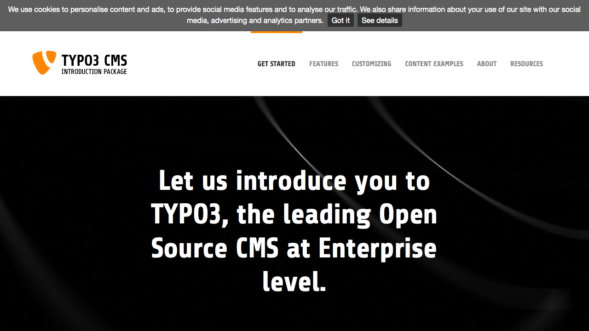

.. ==================================================
.. FOR YOUR INFORMATION
.. --------------------------------------------------
.. -*- coding: utf-8 -*- with BOM.

.. include:: ../Includes.txt

.. _introduction:

Introduction
============

.. _what-it-does:

What does it do?
----------------

   On the 26th of May 2012, the EU government decided it was necessary for every website available inside the EU to have to give visitors the option to allow or disable cookies. While most people saw this as unnecessary and a disruption to collecting analytical data, etc, the EU law was passed. One of the EU's steps towards ruining the internet.

This extension implements the `jQuery CookieBar Plugim by PrimeBox`_ to TYPO3 CMS.

   | The Cookie Bar plugin creates a small bar at the top or bottom of the website with a short message about cookies and accept, decline, and privacy policy buttons.
   | 
   | Once a user has made the decision to either accept or decline, the Cookie Bar slides up, then disappears.
   | 
   | The Cookie Bar can be set up to work in a variety of ways. By default, it uses assumed consent. This means that when a user visits the website, cookies can be set as normal with no interruption. The Cookie Bar is still displayed to provide the user with options for cookies.
   | 
   | It can also be set up to assume refusal. So when a user visits the website, until they press the accept button on the Cookie Bar, no cookies should be set.
   | 
   | You can specify which buttons show on the Cookie Bar. The default is to show the accept and privacy policy buttons and no decline button. This way, assumed consent is used, and the user cannot opt out of cookies. If the user is unhappy about the use of cookies, they can simply leave the website.
   | 
   | The Cookie Bar is also very easy to style. There are just 9 lines of CSS code in total. Changing the heights, widths, background colours, etc. is very quick and easy meaning it can fit in with the website design and colour scheme.

Most featured are implemented by default, only declining cookies deactivated by default, because this requires much more attention to realy deactivate all cookies.

The extension also ships a more stylish css as used on `cookiechoices.org`_.

**For more information about cookie privacy I recommend to read `cookiechoices.org`_.**

.. _jQuery CookieBar Plugim by PrimeBox: http://www.primebox.co.uk/projects/jquery-cookiebar/

.. _cookiechoices.org: http://www.cookiechoices.org

.. _screenshots:

Screenshots
-----------

   Introduction Package with CookieBar

   How the Frontend of the Introduction Package looks like with CookieBar

.. _license:

License
-------

Thanks goes to `PrimeBox`_ for providing this fancy jQuery plugin.

Actually (July 2015) there is no license available, please contact me if there is an update.

.. _PrimeBox: http://www.primebox.co.uk/

.. _contribute:

Contribute
----------

If you have any question or found a bug, feel free to open a new issue or start a pull request in `GitHub`_.

.. _GitHub: https://github.com/jonathanheilmann/ext-jh_cookiebar